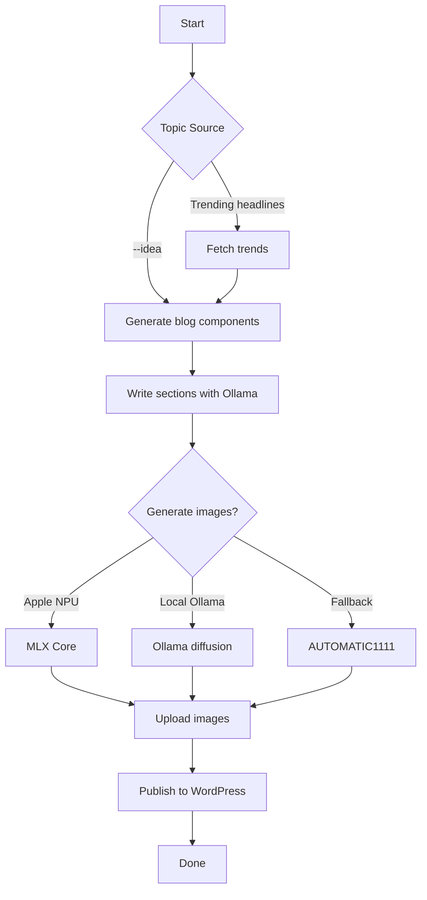

# Trend Poster

Automatically generate, publish, and update SEO-optimized blog posts to WordPress based on trending headlines — powered by OpenAI and the WP REST API.

## Overview

**Trend Poster** continuously fetches trending headlines using NewsAPI and uses OpenAI to generate:
- Titles, meta descriptions, and keyphrases
- Full HTML blog posts (1000+ words)
- Featured image prompts (and auto-generated DALL·E images)
- SEO metadata integration (Yoast-compatible)
- Seamless updates of existing posts (via slug detection)

### Enhanced Image Generation

The system now features enhanced image generation capabilities:
- **Apple Silicon Support**: Automatically detects Apple hardware and uses the Neural Processing Unit (NPU) via MLX Core for faster, more efficient image generation
- **Local Ollama Support**: Automatically detects and uses local Ollama installation with diffusion models if available
- **Fallback Mechanism**: Gracefully falls back to AUTOMATIC1111 API if other methods are unavailable
- **Consistent Output**: Maintains the same high-quality image output regardless of the generation method used

### Code Flow



## Assumptions

- A **WordPress** site with REST API enabled
- An **Application Password** for your WP user
- **Yoast SEO** plugin (for meta patching)
- A **NewsAPI key**
- An **OpenAI** account with `chat-completions` and `images-generations` access
- Python 3.9+
- For Apple NPU support: Apple Silicon Mac with MLX Core and CoreML dependencies installed
- For local Ollama support: Ollama installed with LLM models (llama3:8b) and optionally diffusion models (sdxl:latest)

## Getting Started

1. **Clone the repo**
   ```bash
   git clone https://github.com/yourusername/poster.git
   cd poster
   ```

2. **Install dependencies**
   ```bash
   pip install -r requirements.txt
   ```

3. **Create a `.env` file** with WordPress, OpenAI, and NewsAPI configuration:
   ```ini
   WORDPRESS_URL=https://your-blog.com
   WORDPRESS_USERNAME=your_wp_user
WORDPRESS_APP_PASSWORD=your_app_password
OPENAI_API_KEY=sk-...
NEWSAPI_KEY=your_newsapi_key
SD_API_URL=http://automatic1111:7860  # URL for AUTOMATIC1111 API
OLLAMA_SERVER=ollama-service:11434  # Optional: Remote Ollama server (if local not available)
   ```
    Ensure your environment (e.g., `poster-env`) contains these variables loaded.

## Usage

### Kubernetes Job
```bash
# Manually trigger a one-time CronJob execution
kubectl create job --from=cronjob/trend-poster trend-poster-now -n wp
kubectl logs -n wp job/trend-poster-now -f
```


### Example logs:
```text
📡 Starting trend fetch and post
🧵 New trend: Robot see, robot do...
✅ Upsert complete → https://your-blog.com/2025/04/22/ai-learns-from-videos/
📢 Published: https://your-blog.com/2025/04/22/ai-learns-from-videos/
🎉 Job completed successfully
```


## Running Locally
Generate a blog post with your own topic:

```bash
python post.py --idea "Amazing new tech" --keyphrase "latest tech trends"
```

## Features

- 🔁 Reuses cached posts and images for speed
- 📤 Automatically publishes or updates matching slugs
- 🧠 Logs to both `poster.log` and stdout (Kubernetes friendly)
- 🌐 Fully async-compatible design
- 🍎 Optimized image generation on Apple Silicon using the Neural Processing Unit (NPU)
- 🦙 Support for local Ollama for both text and image generation

## Development & Debugging

To clear caches:
```bash
rm -rf .cache/
```

## License

MIT © Felipe De Bene

